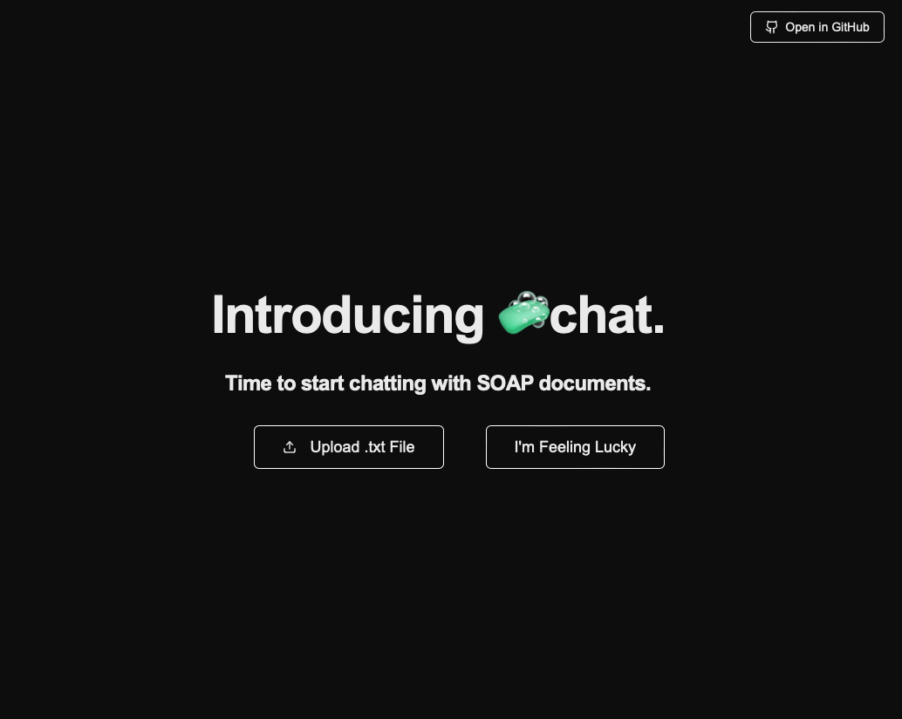
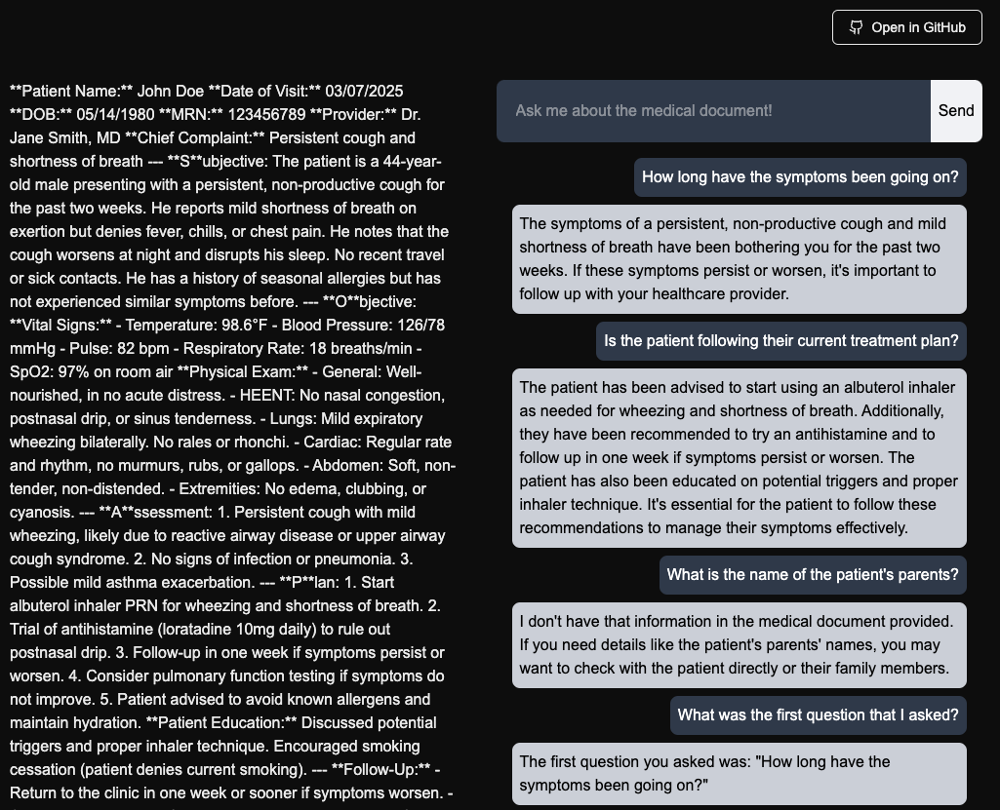

## Deepscribe AI Engineer Coding Challenge
Author: William Pang <br>
Date: March 8, 2025

🧼SOAPChat is a chatbot that allows you to converse with SOAP notes.

What SOAPChat can do:<br>
✅ Answer questions about SOAP notes (in .txt files) in an intuitive chatbot interface<br>
✅ Provides source attribution from medical document, ensuring trust in chatbot<br>
✅ Stores SOAP notes in NoSQL distributed database (MongoDB is the only connection currently offered)<br>
✅ Maintains conversational history when chatting with document, allowing for context to be maintained

🛠️ Project's Tech Stack:
- Langchain
- FastAPI
- Next.Js
- MongoDB
- OpenAI

## Getting Started

1. Ensure that you have Node.js installed, which can be found on the [official website]( https://nodejs.org/)

2. Clone this project onto your local machine
```
git clone https://github.com/bayesandmarkov/deepscribe-coding-challenge/
```
3. (Recommended) Using your terminal, `cd` into the project root folder, create a virtual environment:
```
python3 -m venv venv
source venv/bin/activate
```

Note that the latest Python version is required (as of writing, it is **Python 3.13.2**)

4. Install all the required Python packages

```
pip install -r requirements.txt
```

5. Install all the required Node.js packages
```
npm install
```

6. Create a `.env` file in the project root, with the following variables. You can also find an example under `docs\env.txt`:
```
MONGO_URI=
DB=
COLLECTION=
OPENAI_API_KEY=
CONVERSATIONAL_HISTORY_COLLECTION=
```

7. In your IDE of choice, run the development server via the terminal:
```
npm run dev
```
Open http://localhost:3000 with your browser to see the result.

8. In a separate terminal, run fastapi using Uvicorn:

```
uvicorn api.main:app --host 0.0.0.0 --port 8000 --reload
```

## Let's go (Chrome Recommended)!
1. Once everything is setup, you should be greeted by this landing page:
 

You can generate examples of SOAP documents on ChatGPT, or download some examples under `docs/soap_sample.txt` and upload it (must be `.txt` format) by pressing the "Upload .txt File" button.

> **Note:** Currently, the "I'm Feeling Lucky" button is not supported. The idea was to pick a random example stored in the database of choice, but I did not have enough time to implement this.

2. Once the document is uploaded, you will be routed to a new page that displays the uploaded text, as well as a chatbot where you can start asking questions!
 

## Future Steps/Improvements
*Q: How do you handle large transcripts?*<br>
Currently, there is no method to handle large transcripts that might exceed the context window. One approach would be to perform chunking, which is the idea of splitting up a large document into smaller documents. The smaller documents would likely have some overlap in text, allowing for the system to understand and "piece" back together the long text. Another solution would be to implement RAG everytime a query is made, which will help locate the specific "chunk" of text that is relevant to the query.


*Q: How might you improve the UI interface?*<br>
Currently, I'm using some basic prompt engineering to require the response to "quote" from the document in its thinking process. This is not a very friendly UI interface -- a better approach (as a v2!) would be to dynamically render the source text so it "highlights" the relevant quotes.

*Q: How would you handle edge cases like incomplete transcripts or ambiguous questions?*<br>
The current setup uses simple prompting to prevent ambigious transcripts/incomplete context (by asking the system to say "I don't know"), but more complex configurations such as asking the system to generate a confidence score of its responses combined with some good evaluation system can be implemented. Again, this is a more complex setup but would be a great v2!